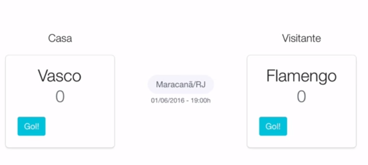

# React Placar

> Um Simples exemplo de uso da biblioteca React.js by [Aprendendo React na prática - Props (Parte 8)](https://www.youtube.com/watch?v=eQV-UV0oz9k)

Passos dos componentes:
- Tudo começa no `App.js` que é o componente que possui os dados
- Esses dados são passados como propriedade para o componente `PlacarContainer`
- O componente `PlacarContainer` contém dois estados `gols_casa` e `gols_visitante` que são manipulados pelos métodos `marcarGolCasa` e `marcarGolVisitante`
- O componente `PlacarContainer` contém mais dois componentes `Partida` e `Time` que recebem as propriedades que o componente `PlacarContainer` herdou do componente  `App.js`
- O componente `Time` utiliza a informação recebida por `PlacarContainer`, renderiza e repassa uma função para o componente `BotaoGol` informando como ele deve marcar um gol
- O componente `BotaoGol` recebe a informação através de propriedade e segue os comandos repassados, que na verdade altera o estada do componente `PlacarContainer`

```JS
`src/app.js`

import React from 'react';
import ReactDOM from 'react-dom';
import App from './src/components/App';

ReactDOM.render(<App />, document.getElementById('root'));
```

```JS
`src/components/App.js`

import React, { Component } from 'react';
import PlacarContainer from './src/components/PlacarContainer';

class App extends Component {

const dados = {
  partida: {
    estadio: "Maracanã/RJ",
    data: "22/05/2017",
    horario: "19h"
  },
  casa: {
    nome: "Vasco"
  },
  visitante: {
    nome: "Flamengo"
  }
}

  render() {
    //- passando as propriedades do componente `App` para o componente `PlacarContainer`
    return <PlacarContainer partida={ dados.partida}
                            casa={ dados.casa}
                            visitante={ dados.visitante} />;
}

export default App;
```

```JS
`src/components/PlacarContainer.js`

import React, { Component } from 'react';
import Time from './src/components/Time';
import Partida from './src/components/Partida';

class PlacarContainer extends Component {
  constructor() {
    super();
    this.state = {
      gols_casa: 0,
      gols_visitante: 0
    }

    marcarGolCasa() {
      this.setState({
        gols_casa: this.setState.gols_casa + 1
      })
    }

    marcarGolVisitante() {
      this.setState({
        gols_visitante: this.setState.gols_visitante + 1
      })
    }
  }

  render() {
    return (
      <div>
        <div>
          <h3>casa</h3>
          <Time nome={this.props.casa.nome} 
                gols={this.state.gols_casa}
                marcarGol={this.marcarGolCasa.bind(this)} />
        </div>
        <div>
          <Partida estadio={this.props.partida.estadio} 
                   data={this.props.partida.data}
                   horario={this.props.partida.horario />
        </div>
        <div>
          <h3>Visitante</h3>
          <Time nome={this.props.visitante.nome} 
                gols={this.state.gols_visitante}
                marcarGol={this.marcarGolvisitante.bind(this)} />
        </div>
      </div>
    )
}

export default PlacarContainer;
```

```JS
`src/components/Time.js`

import React, { Component } from 'react';
import BotaoGol from './src/components/BotaoGol';

class Time extends Component {

  render() {
    return (
      <div>
        <h1>{this.props.nome}</h1>
        <h1>{this.props.gols}</h1>
        <BotaoGol marcarGol={this.props.marcarGol} />
      </div>
    )
}

export default Time;
```

```JS
`src/components/Partida.js`

import React, { Component } from 'react';

class Partida extends Component {

  render() {
    return (
      <div>
        h2>{this.props.estadio}</h2>
        <div>
          <span>{this.props.data}</span>
          <span>-</span>
          <span>{this.props.horario}</span>
        </div>
      </div>
    )
}

export default Partida;
```

```JS
`src/components/BotaoGol.js`

import React, { Component } from 'react';

class BotaoGol extends Component {
  thishandleClick(event) {
    event.preventDefault(); //- ação para cancelar o evento padrão do botão.
    this.props.marcarGol(); //- ao clicar irá acionar esse método  que pertence ao componente PlacarContainer 
  }

  render() {
    return (
      <button onClick={thishandleClick.bind(this)}><button>
    )
}

export default BotaoGol;
```